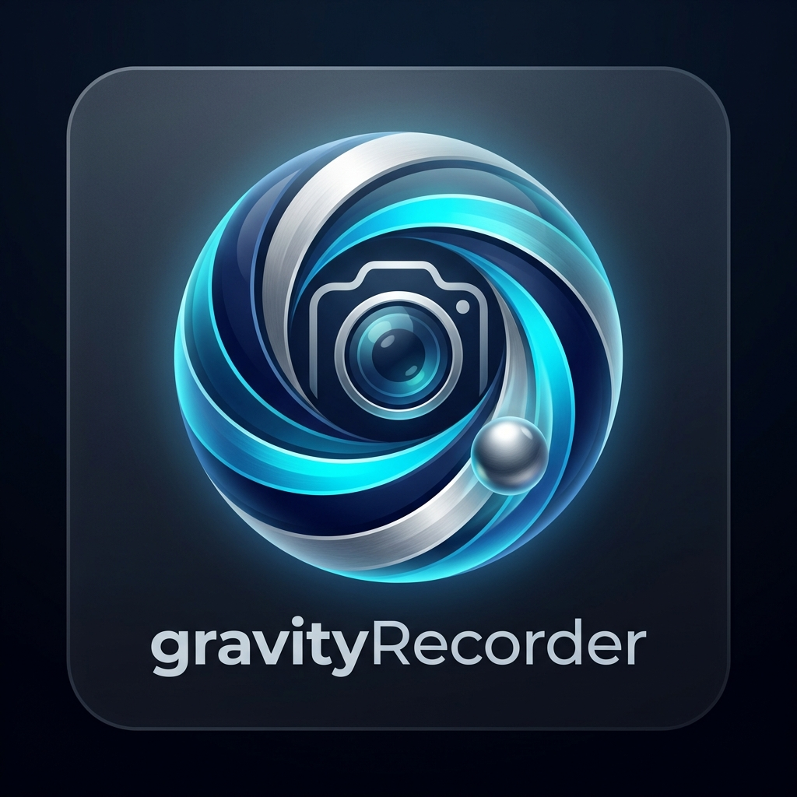
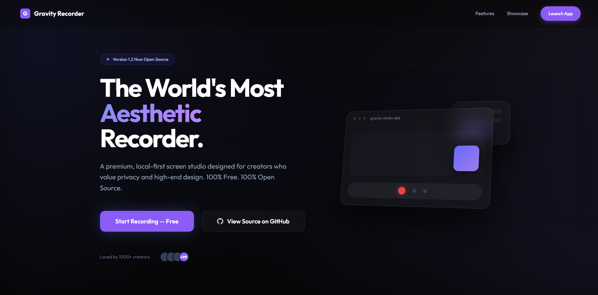
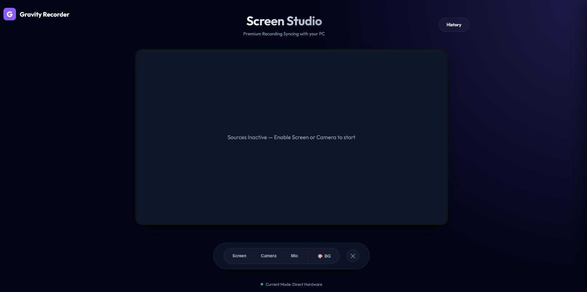
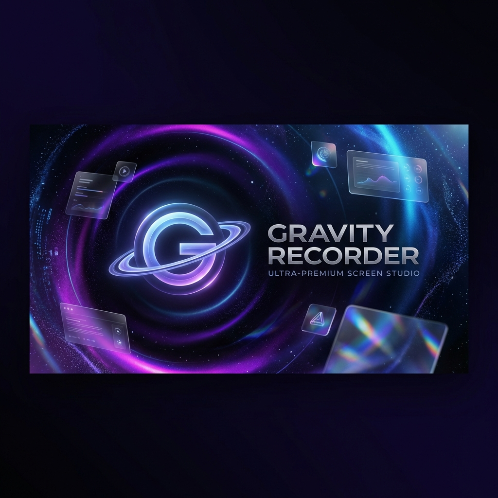

# 🌌 Gravity Recorder

<div align="center">
  
  <h1>The Aesthetic Loom Alternative</h1>
  <p><b>100% Private, Local-First, and Browser-Based Screen Studio for High-End Creators.</b></p>

  [](LICENSE)
  [](https://gravityrecorder.com)
  [](CONTRIBUTING.md)
  []()
</div>

---

## 📸 Preview

<div align="center">
  
  <br />
  
</div>

---

## 📺 Watch the Tutorial

<div align="center">
  <p><b>Watch this video to see the studio in action and learn how to use Gravity Recorder:</b></p>
  <a href="https://youtu.be/Rkdov0z35K8">
    
  </a>
  <br />
  <p><i>Zero setup. Zero lag. 100% Privacy.</i></p>
</div>

---

## 🚀 Why Gravity? (The Tella Alternative)

Most screen recorders require logins, upload your data to their servers, and hit you with subscription walls. **Gravity is built differently.**

### ⚖️ Comparison: SaaS vs. Gravity

| Feature | Loom / Tella / Cap | Gravity Recorder |
| :--- | :--- | :--- |
| **Price** | Paid Subscriptions | **$0 (100% Free)** |
| **Privacy** | Stored on Cloud | **Local-First (Privacy)** |
| **Login** | Mandatory Account | **No Login Required** |
| **Setup** | Docker / S3 / SQL | **Zero Infrastructure** |
| **Aesthetics** | Generic | **Studio-Grade UI** |

---

## ✨ Key Features

- **🎨 Multi-Layer Gallery**: Overlay your webcam on your screen with real-time scaling and styling.
- **🔳 Shape-Shifting Webcam**: Switch between Circle, Square, and Rounded patterns instantly.
- **📍 Draggable Studio**: Move your webcam and UI elements anywhere on the canvas while recording.
- **📂 Hybrid Cloud Sync**: Integrated with Google Drive API. Keep the source local, share the link in seconds.
- **⚙️ Direct Hardware Access**: Zero-lag recording using direct-to-disk chunking via the File System Access API.

---

## 🛡️ Technical FAQ

### 1. How is it private if it's a web app?
Gravity uses the **Browser File System Access API**. We don't have a backend to store your videos. When you hit save, the browser writes the stream directly to a folder you select on your computer. Your data never touches our servers.

### 2. Does it work on all browsers?
Gravity is optimized for **Chromium-based browsers** (Chrome, Edge, Brave) which support the advanced File System and Media Capture APIs.

### 3. How do I get a "Prebuilt" release?
Gravity is a high-performance **Web Studio** accessible directly via the web. Standalone Electron builds (.exe/.dmg) are currently in development.

---

## 📦 Downloads & Pre-releases

Gravity is primarily a **Web-First Studio**. You can use the full production version today at **[gravityrecorder.com](https://gravityrecorder.com)**.

### Experimental Builds
For those who want to test the latest experimental features or help us debug the upcoming standalone releases:
- **Web Pre-releases**: Hosted on our `beta` branch.
- **Desktop Alpha**: Coming soon to our [Releases](https://github.com/uzairkath/gravityRecorder/releases).

---

## 🚀 Local Setup

1. **Clone & Install**:
   ```bash
   git clone https://github.com/uzairkath/gravityRecorder.git
   cd gravityRecorder
   npm install
   ```

2. **Launch Development**:
   ```bash
   npm run dev
   ```

3. **Production Build**:
   ```bash
   npm run build
   ```

---

## 🤝 Contributing

We welcome everything from bug reports (Vibe-fixes) to deep architectural updates. Check out our **[CONTRIBUTING.md](CONTRIBUTING.md)** to get started.

---

## 📄 License

This project is licensed under the **MIT License**.

---
<div align="center">
  Built with ❤️ for the community by <a href="https://github.com/uzairkath">Uzair Kath</a>.
</div>
